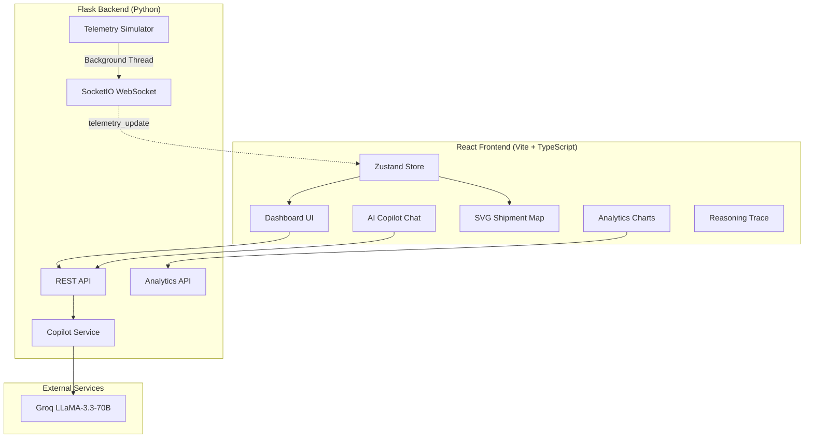

<div align="center">
  
  <h1>ChainSight AI</h1>
  <p><strong>Autonomous Supply Chain Control Tower</strong></p>
  <p>AI-powered operational intelligence platform for C-suite executives — combining real-time telemetry, exception tracking, and explainable AI actions in a single enterprise workspace.</p>

  <br />

  
  
  
  
  
  

</div>

---

## ✨ Features

| Feature | Description |
|---|---|
| 🤖 **AI Copilot** | Natural-language querying via Groq LLaMA 3.3 70B with structured JSON responses (root cause, financial impact, prescriptive mitigations) |
| 🔍 **Reasoning Transparency** | Step-by-step AI decision trace visible in real-time — every action is auditable |
| 📡 **Real-Time Telemetry** | WebSocket-based event stream (Flask-SocketIO) broadcasting live anomaly alerts (weather, port congestion, customs holds) |
| 🗺️ **Interactive Shipment Map** | SVG world map with animated trade routes, status-coded markers, and pulsing port indicators |
| 📊 **Advanced Analytics** | 4 interactive Recharts visualizations (volume trends, delay distribution, SLA compliance donut, cost exposure timeline) + regional performance table — all served from Flask API |
| 🔄 **Live KPI Tiles** | Dynamic metrics fetched from backend API with animated number counting on load |
| 🌓 **Dark/Light Mode** | Seamless theme switching with persisted state via Zustand |
| 🧠 **Zustand State Management** | Fully typed global store managing chat, alerts, shipments, and real-time telemetry state |
| 🛡️ **Error Boundary** | Production-grade React error boundary with styled recovery UI |
| 📦 **Demo Mode** | Graceful fallback to mock data when no LLM API key is configured |

---

## 🏗️ Architecture



---

## 🚀 Quick Start

### Prerequisites
- **Node.js** ≥ 18
- **Python** ≥ 3.10
- (Optional) **Groq API Key** for live LLM responses

### Backend

```bash
cd backend
python -m venv .venv
.venv/Scripts/activate        # Windows
# source .venv/bin/activate   # macOS/Linux
pip install -r requirements.txt
python app.py
```

### Frontend

```bash
cd frontend
npm install
npm run dev
```

Open [http://localhost:5173](http://localhost:5173) in your browser.

---

## ⚙️ Environment Variables

| Variable | Required | Description |
|---|---|---|
| `GROQ_API_KEY` | No | Groq API key for LLaMA 3.3 inference. Without it, the app runs in **Demo Mode** with realistic mock responses. |
| `PORT` | No | Backend server port (default: `5000`) |
| `VITE_BACKEND_URL` | No | Frontend → Backend URL (default: `http://localhost:5000`) |

---

## 📁 Project Structure

```
ChainSight-AI/
├── backend/
│   ├── api/
│   │   ├── routes.py              # Core copilot & webhook endpoints
│   │   └── analytics_routes.py    # KPI summary & trend data API
│   ├── services/
│   │   ├── copilot_service.py     # LLM prompt engineering & mock fallback
│   │   ├── simulator.py           # Real-time telemetry event broadcaster
│   │   ├── rag_engine.py          # ChromaDB vector search (optional)
│   │   └── agent_tools.py         # LangChain agent tooling
│   ├── core/errors.py             # Centralized error handling
│   ├── models/schemas.py          # Pydantic request validation
│   ├── app.py                     # Flask + SocketIO entry point
│   └── requirements.txt           # Production dependencies (lean)
├── frontend/
│   ├── src/
│   │   ├── pages/
│   │   │   ├── Dashboard.tsx      # Executive overview + live KPIs + map
│   │   │   ├── Shipments.tsx      # Global shipment registry with filters
│   │   │   ├── Incidents.tsx      # SLA breach escalation center
│   │   │   ├── Analytics.tsx      # Interactive charts & regional data
│   │   │   └── Settings.tsx       # Platform governance admin
│   │   ├── components/
│   │   │   ├── map/ShipmentMap.tsx          # SVG animated world map
│   │   │   ├── analytics/AnalyticsCard.tsx  # KPI tile with sparkline
│   │   │   ├── chat/ChatPanel.tsx           # AI copilot interface
│   │   │   ├── timeline/ExecutionTimeline.tsx
│   │   │   └── ErrorBoundary.tsx            # Production error handler
│   │   ├── hooks/useRealtime.ts   # WebSocket lifecycle manager
│   │   ├── store/useAppStore.ts   # Typed Zustand global state
│   │   └── types/index.ts         # TypeScript interfaces
│   └── vite.config.ts             # Build config with chunk splitting
├── render.yaml                    # Render.com one-click deploy
├── vercel.json                    # Vercel frontend deploy config
└── README.md
```

---

## 🌐 Deployment

### Backend → [Render](https://render.com) (Free Tier)
1. Connect your GitHub repo on Render → **New Web Service**
2. Render auto-detects `render.yaml` — click **Deploy**
3. Add `GROQ_API_KEY` in the **Environment** tab

### Frontend → [Vercel](https://vercel.com) (Free Tier)
1. Import your GitHub repo on Vercel → **New Project**
2. Set **Root Directory** to `frontend`
3. Add env var: `VITE_BACKEND_URL` = your Render backend URL
4. Deploy

---

## 📝 License

MIT © 2026
